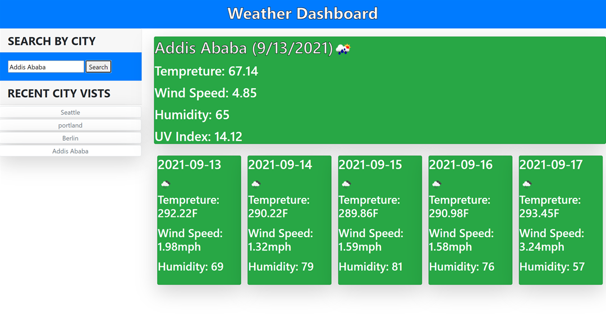

# Weather Dashboard 

# Discription 

This application is a weather dashboard with curent forecast and next five day forcast. It is powered by the open weather API with an uptodate data in JSON format. User experince is dynamicly designed using jQuery, CSS and HTML. The user will be able to search any city and will be able to get the curent date and the next five dates of the forecaset. As well tempreture, wind speed, humidity, UV Index, and icons for the respective forecasts. With the search history you will be able to view past cities forcasts.  

# Deployed 

https://kelebetengida.github.io/Weather-CH/

# Table of Content 

[Discription]()

[Deployed-Link]()

[Usage]()

[Technologies]()

[Questions]()

[Acknowledgments]()

# Usage

</img>

# Thechnologies

HTML

CSS

Javascript

Jquery

Bootstrap

# Questions

GitHub: [github.com/kelebetengida]()

Email: [engidk@uw.edu]()

# Acknowledgments

Thankkyou to my instractors who have helped me through the learning curve of this project. 